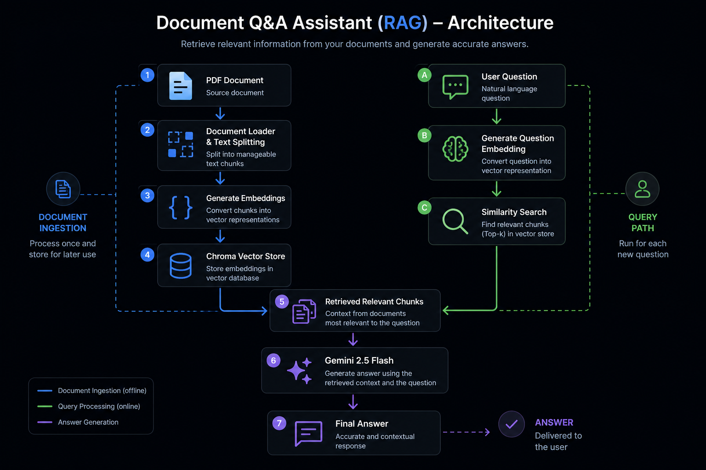
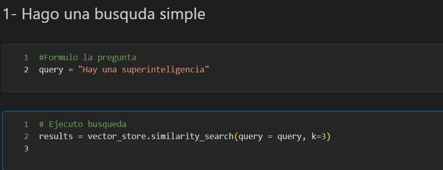
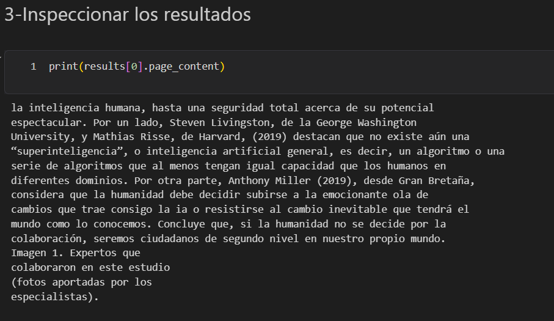
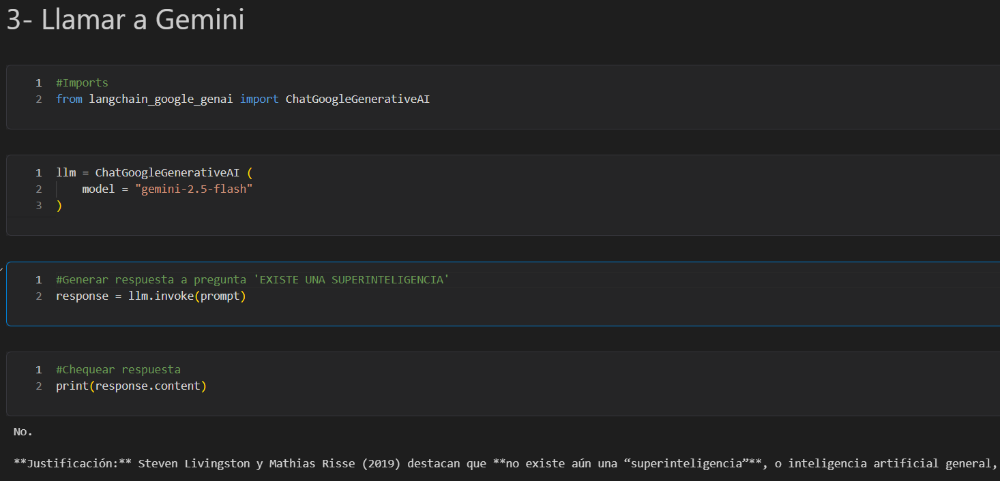

# 📄 Document Q&A Assistant (RAG)

<br>

[](https://postimg.cc/FdNyhTRh)

<br>

## 📌 Project Overview

This project implements a Retrieval-Augmented Generation (RAG) pipeline that allows users to ask questions about PDF documents and receive context-aware answers.

Instead of relying solely on the language model's internal knowledge, the application retrieves the most relevant information from the document using semantic search before generating the final response with Gemini 2.5 Flash.

<br>

## 🎯 Business Objective

Large Language Models can generate inaccurate or hallucinated responses when they lack domain-specific knowledge.

The objective of this project is to improve answer reliability by combining semantic search with LLMs, enabling the model to answer questions using the actual content of a document.

<br>

## 🛠 Technologies Used

- Python
- LangChain
- Gemini 2.5 Flash
- Google Embeddings
- Chroma Vector Store
- PyPDFLoader
- RecursiveCharacterTextSplitter

<br>

## ⚙ Architecture

The system is divided into two stages:

**Offline Processing**
- Load PDF document
- Split document into chunks
- Generate embeddings
- Store vectors in Chroma

**Online Query Processing**
- Receive user question
- Generate query embedding
- Perform similarity search
- Retrieve relevant chunks
- Generate contextual answer using Gemini

<br>

## 📸 Workflow

### Architecture Overview



<br>

### Step 1 — Semantic Search

The user question is converted into a semantic representation to retrieve the most relevant chunks from the vector database.



<br>

### Step 2 — Retrieved Context

The retriever returns the document fragments that are most relevant to the user's question.




<br>

### Step 3 — Answer Generation

Gemini 2.5 Flash generates the final answer using the retrieved context instead of relying only on its pretrained knowledge.



<br>

## 🚀 Business Value

### This project demonstrates:

- Retrieval-Augmented Generation (RAG)
- Semantic Search
- Embedding Generation
- Vector Databases
- Document Question Answering
- LangChain Pipelines
- Gemini API Integration

<br>

## 🧠 Key Learnings

✔ Document Loading

✔ Text Chunking

✔ Embedding Models

✔ Vector Databases

✔ Semantic Search

✔ Context Retrieval

✔ Retrieval-Augmented Generation (RAG)

✔ Prompt Construction

✔ LangChain Integration

<br>

## 🚀 Future Improvements

✔ Conversational Memory

✔ Multi-document Support

✔ Chat History

✔ Hybrid Search (BM25 + Vector Search)

✔ Metadata Filtering

✔ Web Interface with Gradio

✔ Persistent Vector Database

✔ Citation-aware Responses


✔ Gemini 2.5 Flash

```
